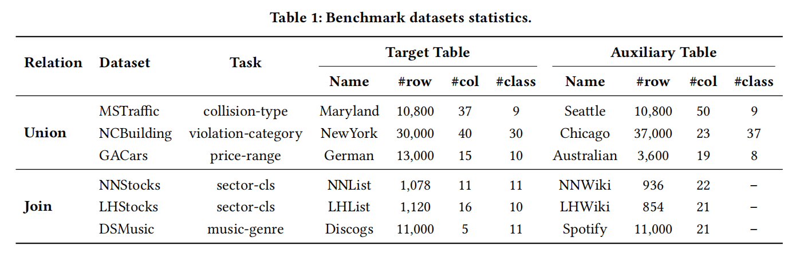

# LakeMLB: Data Lake Machine Learning Benchmark

[](https://arxiv.org/abs/2602.10441)

**Official implementation of the LakeMLB benchmark**

> **LakeMLB: Data Lake Machine Learning Benchmark**  
> Feiyu Pan, Tianbin Zhang, Aoqian Zhang, Yu Sun, Zheng Wang, Lixing Chen, Li Pan, Jianhua Li  
> *arXiv preprint arXiv:2602.10441, 2026*  
> [[Paper](https://arxiv.org/abs/2602.10441)]

---

## About

**LakeMLB** is a standardized benchmark for evaluating machine learning methods on multi-table scenarios in data lake environments. It addresses the critical challenge of leveraging weakly-associated heterogeneous tables to improve downstream ML performance.

### Key Features

- **Real-world datasets**: Six curated datasets covering finance, government, and e-commerce domains
- **Two core scenarios**: Join-based and union-based multi-table integration
- **Standardized evaluation**: Fixed train/validation/test splits for reproducibility
- **Comprehensive baselines**: 15+ methods including tree models, neural networks, transfer learning, and foundation models
- **Augmentation strategies**: Pre-computed Feature Augmentation (FA) and Data Augmentation (DA) results

---

## Repository Structure

```
LakeMLB/
├── benckmark/              # Benchmark datasets
│   ├── join_based/         # dsmusic, lhstocks, nnstocks
│   └── union_based/        # gacars, mstraffic, ncbuilding
├── benchmark_extra/        # Pre-computed FA/DA augmentation results
├── baseline/               # Model implementations
├── scripts/                # Experiment scripts
├── datasets/               # Data loading utilities
└── lib/                    # Modified third-party libraries
```

---

## Datasets

### Statistics



All datasets are located in `benckmark/` with two categories:

- **Join-based** (`join_based/`): dsmusic, lhstocks, nnstocks
- **Union-based** (`union_based/`): gacars, mstraffic, ncbuilding

Each dataset includes source CSV files, pre-computed split masks (`mask.pt`), and detailed documentation.

### Augmentation Data

The `benchmark_extra/` directory contains pre-computed augmentation results for reproducibility:

- `results_fa_*/` — Feature Augmentation (FA) outputs
- `results_da_*/` — Data Augmentation (DA) outputs

---

## Baselines

We provide implementations of 15+ methods across four categories:

| Category | Methods | Entry Point |
|----------|---------|-------------|
| **Tree-based** | XGBoost, CatBoost, LightGBM | `tree_models.py` |
| **Neural networks** | FT-Transformer, TabTransformer, ExcelFormer, SAINT, TromptNet | `tnns_test.py` |
| **Transfer learning** | TransTab, CARTE | `transtab_*.py`, `carte_*.py` |
| **Foundation models** | TabPFN v2, TabICL | `tabpfnv2.py`, `tabicl_clf.py` |

---

## Quick Start

Run all baseline methods with default hyperparameters:

```bash
bash scripts/example.sh
```

For systematic evaluation:

```bash
# Tree models (CPU)
bash scripts/run_tree_models.sh

# Neural networks (GPU)
bash scripts/run_nn_grid_search.sh

# Transfer learning (GPU)
bash scripts/run_transtab.sh
bash scripts/run_carte.sh

# Foundation models (GPU)
bash scripts/run_fundation_models.sh
```

---

## Requirements

### Dependencies

Modified third-party libraries are bundled in `lib/` with unified data loading and standardized preprocessing:

- **rllm**: Our team's open-source library for tabular learning ([rllm-team/rllm](https://github.com/rllm-team/rllm))
  - To reproduce experiments, clone the repository and place it in `lib/rllm/`
  - ```bash
    git clone https://github.com/rllm-team/rllm.git lib/rllm
    ```
- **transtab**, **carte_ai**: Modified versions for benchmark compatibility

### External Resources

**CARTE** requires FastText embeddings:
- Download [`cc.en.300.bin.gz`](https://dl.fbaipublicfiles.com/fasttext/vectors-crawl/cc.en.300.bin.gz)
- Extract and place at `lib/FastText/cc.en.300.bin`

**TabICL** requires model checkpoint (103 MB, not included):
- Obtain `tabicl-classifier-v1.1-0506.ckpt`
- Place at `lib/huggingface/hub/models--jingang--TabICL-clf/snapshots/main/tabicl-classifier-v1.1-0506.ckpt`

---

## Citation

If you find LakeMLB useful in your research, please cite:

```bibtex
@article{pan2026lakemlb,
  title={LakeMLB: Data Lake Machine Learning Benchmark},
  author={Pan, Feiyu and Zhang, Tianbin and Zhang, Aoqian and Sun, Yu and Wang, Zheng and Chen, Lixing and Pan, Li and Li, Jianhua},
  journal={arXiv preprint arXiv:2602.10441},
  year={2026}
}
```

---

## License

This project is provided for academic and research purposes. Refer to individual dataset README files for data provenance and licensing details.
