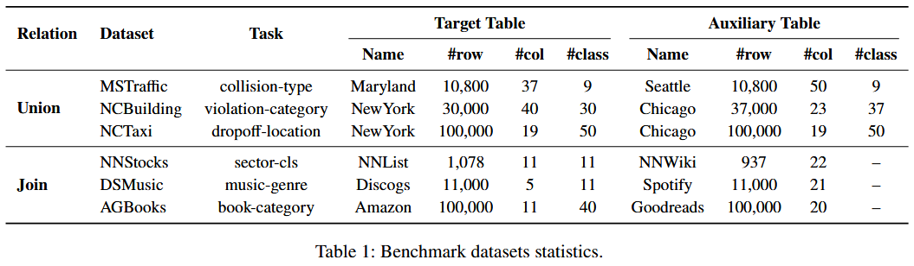

# LakeMLB: Data Lake Machine Learning Benchmark

[](https://arxiv.org/abs/2602.10441)

Official implementation of **LakeMLB: Data Lake Machine Learning Benchmark**.

> Feiyu Pan, Tianbin Zhang, Aoqian Zhang, Yu Sun, Zheng Wang, Lixing Chen,
> Li Pan, and Jianhua Li.
> *arXiv preprint arXiv:2602.10441, 2026.*
> [[Paper](https://arxiv.org/abs/2602.10441)]

## Overview

LakeMLB evaluates how machine learning methods use weakly associated,
heterogeneous tables from data lakes for downstream tabular classification.
The benchmark contains six real-world datasets and two multi-table relations:

- **Union-based:** the task and auxiliary tables describe similar entities or
  events but may use different schemas and label vocabularies.
- **Join-based:** task rows are associated with auxiliary rows through weak
  entity matching, such as company, song, or book names.

The implementation provides fixed data splits, data construction utilities,
feature/data augmentation variants, and 12 baselines across four model
families.

## Repository Structure

```text
LakeMLB/
├── benckmark/
│   ├── union_based/              # Packaged MSTraffic, NCBuilding, NCTaxi
│   └── join_based/               # Packaged NNStocks, DSMusic, AGBooks
├── codes/
│   ├── baseline/                 # Model implementations and result utilities
│   ├── data/                     # Data-construction utilities; runtime data is local
│   ├── lib/                      # Adapted TransTab/CARTE source and setup guide
│   ├── scripts/                  # Maintained experiment entry points
│   └── results/                  # Local results, logs, checkpoints, and artifacts
├── requirements.txt              # Tested Python package versions
└── benchmark_details.png         # Dataset statistics
```

## Datasets



| Relation | Dataset | Task table | Auxiliary table | Task label | Classes |
|---|---|---|---|---|---:|
| Union | MSTraffic | Maryland | Seattle | `Collision Type` | 9 |
| Union | NCBuilding | New York | Chicago | `StatuteCodes` | 30 |
| Union | NCTaxi | New York | Chicago | `dolocationid` | 50 |
| Join | NNStocks | NNList | NNWiki | `sector` | 11 |
| Join | DSMusic | Discogs | Spotify | `genres` | 11 |
| Join | AGBooks | Amazon | Goodreads | `categories` | 40 |

Packaged archives are stored under `benckmark/`, and each archive contains its
dataset README. Working CSV files, processed tables, and split masks are
generated locally and are not committed under `codes/data/`.

### Augmentation Variants

- **Feature Augmentation (FA):** auxiliary features are horizontally joined to
  task rows using entity mappings or nearest-neighbor matching.
- **Data Augmentation (DA):** compatible task and auxiliary rows are vertically
  concatenated after schema handling.
- **Join ablations:** selected datasets include 1-NN, 2-NN, 4-NN, 8-NN, and
  random-match variants.

The original split masks are reused by augmented task tables so methods are
evaluated on consistent task rows.

## Baselines

| Family | Methods | Maintained entry point |
|---|---|---|
| Tree-based | XGBoost, CatBoost, LightGBM | `codes/scripts/run_tree_models.sh` |
| Deep tabular | FT-Transformer, TabTransformer, ExcelFormer, SAINT, TromptNet | `codes/scripts/run_nn_grid_search.sh` |
| Transfer learning | TransTab, CARTE | `codes/scripts/run_transtab.sh`, `codes/scripts/run_carte.sh` |
| Foundation models | TabPFN v3, TabICLv2 | `codes/scripts/run_tabpfn.sh`, `codes/scripts/run_tabicl.sh` |

Tree and deep tabular baselines perform validation-based grid search before
repeated evaluation. Transfer and foundation-model runners support repeated
runs, per-run seeds, runtime measurement, persistent logs, and result
aggregation.

## Quick Start

The tested environment uses Python 3.9 and is recorded in
[`requirements.txt`](requirements.txt). Before running experiments, prepare
rLLM and the external model files described in
[`codes/lib/README.md`](codes/lib/README.md). Then activate the project
environment and run commands from the repository root:

```bash
cd LakeMLB
conda activate lake
```

Except for CARTE, a table is selected by dataset name and by its index in the
dataset class's `processed_filenames` list:

```bash
# Tree models
bash codes/scripts/run_tree_models.sh \
  --dataset mstraffic --table_idx 0 --device 1 --num_runs 10 --num_threads 16

# Deep tabular models
bash codes/scripts/run_nn_grid_search.sh \
  --dataset mstraffic --table_idx 0 --gpu 1 --num_runs 10 --num_tasks 2

# TransTab single-table classification
bash codes/scripts/run_transtab.sh \
  --mode single --dataset mstraffic --table_idx 0 --gpu 1 --num_runs 10

# TabPFN v3
bash codes/scripts/run_tabpfn.sh \
  --dataset mstraffic --table_idx 0 --gpu 1 --num_runs 10

# TabICLv2
bash codes/scripts/run_tabicl.sh \
  --dataset mstraffic --table_idx 0 --gpu 1 --num_runs 10
```

CARTE selects independently preprocessed tables with `--data_name` in single
mode or `--target_data_name/--source_data_name` in joint mode.

See [codes/scripts/README.md](codes/scripts/README.md) for all maintained
commands, TransTab/CARTE modes, concurrency options, output directories, and
`nohup` usage. Every shell entry point also supports `--help`.

## Outputs

Experiments write persistent files under `codes/results/`:

```text
tree_models/          Tree grid-search and final results
grid_search/tnns/     Deep-model grid-search shards and merged results
tnns/                 Deep-model repeated-run summaries
transfer/             TransTab and CARTE results
foundation/           TabPFN and TabICL results
artifacts/            Selected checkpoints and model files
logs/                 Method-specific terminal logs
nohup/                Optional outer logs for detached jobs
```

Repeated-run JSON files retain the actual random seed, metrics, and runtime for
each run. Summary files report aggregate statistics.

## Dependencies and Model Files

Pinned versions of the main packages, including PyTorch, XGBoost, CatBoost,
LightGBM, TabPFN, TabICL, Transformers, and FAISS, are listed in
[`requirements.txt`](requirements.txt).

LakeMLB-adapted versions of TransTab and CARTE are retained under `codes/lib/`.
rLLM is not bundled; the required local package layout and LakeMLB dataset
integration requirements are documented in
[`codes/lib/README.md`](codes/lib/README.md).

External model resources:

- **CARTE:** place `cc.en.300.bin` at
  `codes/lib/FastText/cc.en.300.bin` and `kg_pretrained.pt` at
  `codes/lib/carte_ai/data/etc/kg_pretrained.pt`. CARTE CSV files, masks, and
  preprocessed Parquet/config files are also local-only resources.
- **TabPFN v3:** the default classifier uses the TabPFN cache. Initial weight
  access requires a Prior Labs account/API key and acceptance of the applicable
  model license; `run_tabpfn.sh --model_path` can select a local checkpoint.
- **TabICLv2:** `run_tabicl.sh` defaults to
  `tabicl-classifier-v2-20260212.ckpt` and supports automatic download or an
  explicit `--model_path`.

## Citation

If you find LakeMLB useful in your research, please cite:

```bibtex
@article{pan2026lakemlb,
  title={LakeMLB: Data Lake Machine Learning Benchmark},
  author={Pan, Feiyu and Zhang, Tianbin and Zhang, Aoqian and Sun, Yu and Wang, Zheng and Chen, Lixing and Pan, Li and Li, Jianhua},
  journal={arXiv preprint arXiv:2602.10441},
  year={2026}
}
```

## License

This project is intended for academic and research use. Refer to each dataset's
README for provenance, citation requirements, and redistribution terms.
